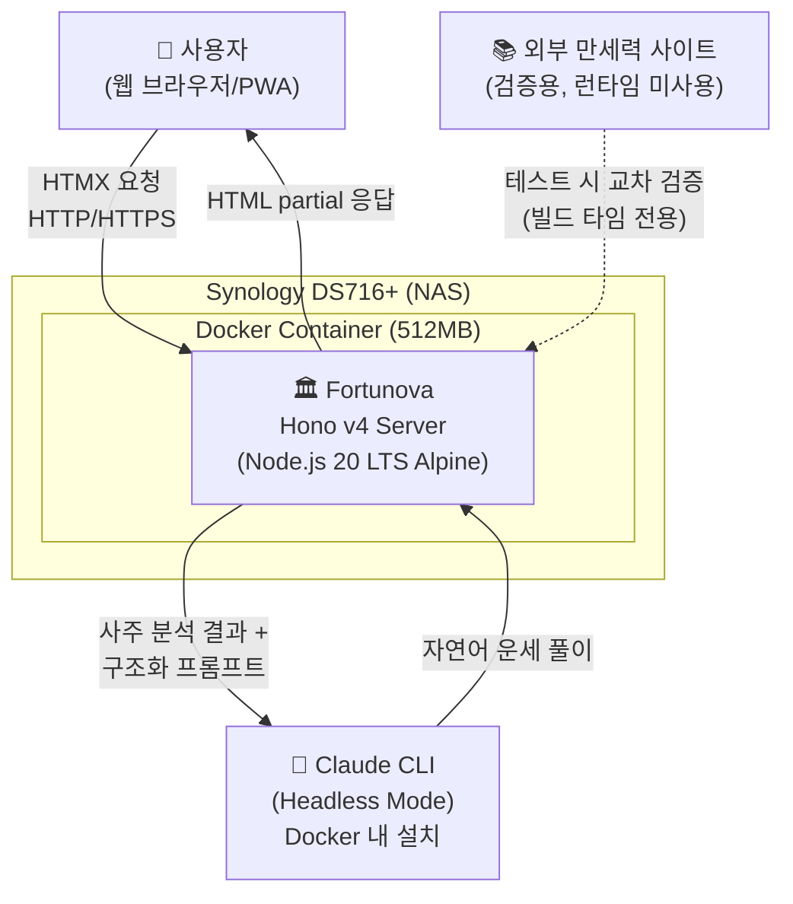
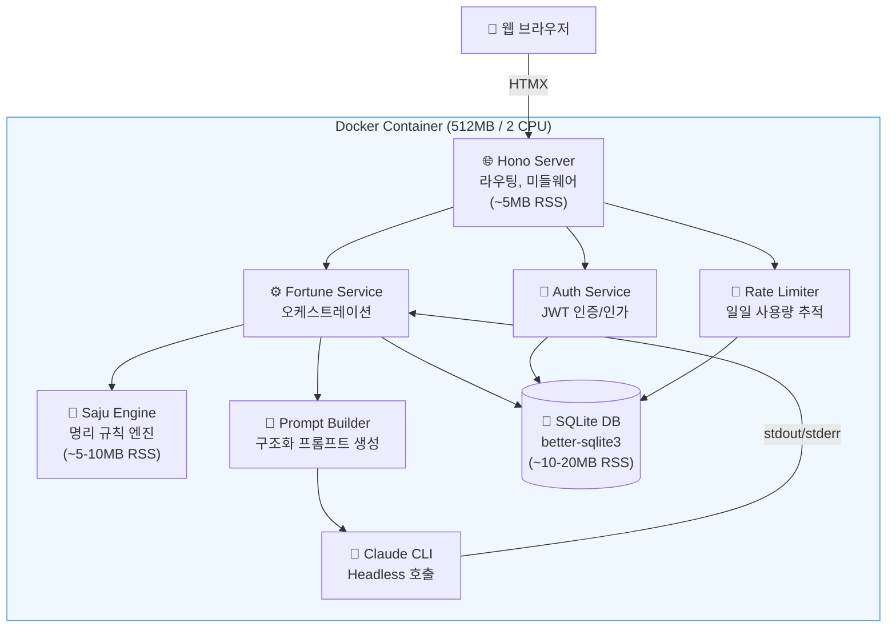
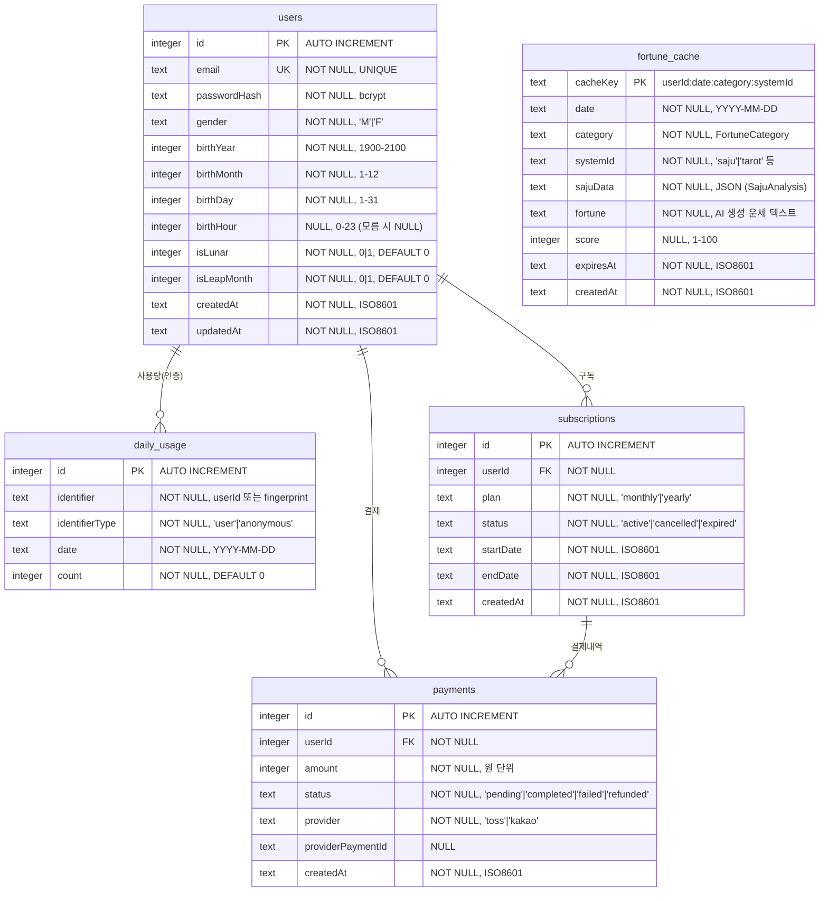
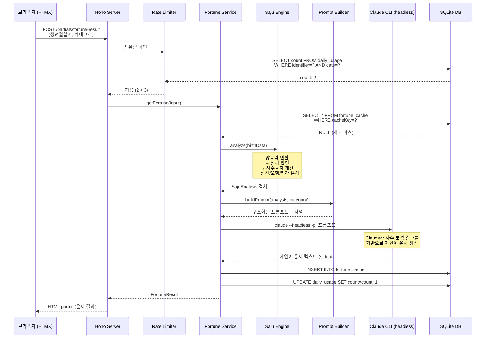
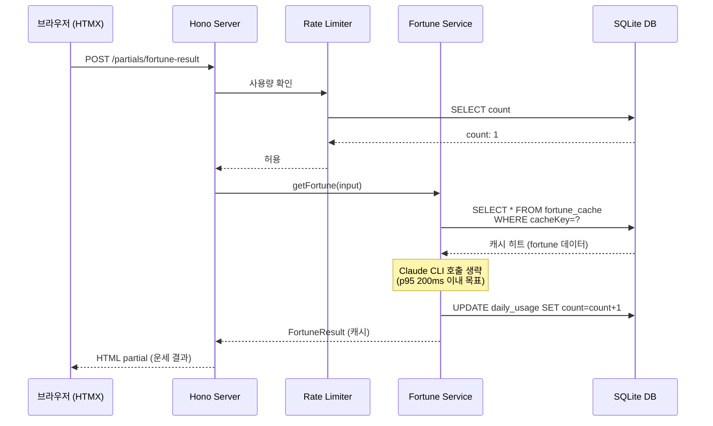
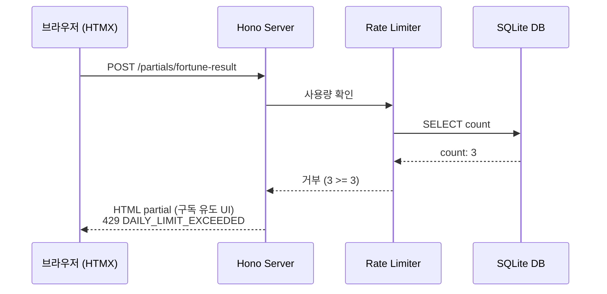

## 1. 개요

### 1.1 배경

국내 운세 서비스 시장에는 5개 유형의 플레이어가 존재한다:

| 서비스 | 유형 | 핵심 특징 | 누적 이용자 |
|--------|------|----------|------------|
| 네이트 운세 | 전통 포털형 | 다양한 콘텐츠 + 전문가 전화상담 | - |
| 포스텔러 | 모바일 앱 | 동서양 운세 통합 + 월 22편 신규 콘텐츠 | 860만+ |
| 신운세 | 전문 웹 | 사주/명리 전문 특화 (만세력, 택일, 작명) | - |
| Co-Star | 모바일 앱 | NASA 데이터 + AI 점성술, 소셜 바이럴 | 3,000만+ |
| 신한생명/농협 | 프로모션 웹 | 기업 브랜딩 목적 무료 시즌 한정 | - |

기존 서비스들은 두 가지 한계를 공통으로 가진다:
1. **전통 명리학 서비스**(네이트, 신운세)는 정형화된 텍스트를 반복 출력하며 개인화 수준이 낮다
2. **AI 기반 서비스**(Co-Star)는 서양 점성술에 특화되어 동양 명리학 영역을 다루지 않는다

### 1.2 동기

사주/명리학은 한국에서 연간 4조원 규모의 시장이나, 기술 기반 혁신이 가장 더딘 분야 중 하나다. 전통 규칙 엔진(천간지지, 오행, 60갑자, 십신 등)의 정확한 계산과 LLM의 자연어 해설 능력을 결합하면, Co-Star가 서양 점성술에서 달성한 AI 초개인화를 동양 명리학에 적용할 수 있다.

NAS(Synology DS716+, 2GB RAM) 환경에서 자체 호스팅하여 인프라 비용을 최소화하면서, 무료 3회/일 + 구독 모델로 수익 구조를 검증한다.

### 1.3 문제 정의

전통 사주 명리 규칙 엔진의 계산 정확성과 LLM의 자연어 해설 능력을 하나의 경량 시스템으로 결합하여, NAS 환경(512MB 메모리)에서 안정적으로 운영 가능한 AI 운세 웹서비스를 구축한다.

---

## 2. Goals & Non-Goals

### 2.1 Goals

1. **사주 계산 정확도 100%**: 전통 사주 명리 규칙 엔진과 Claude를 결합한 하이브리드 운세 시스템을 구축하여, 50+ 검증 케이스(만세력닷컴, 더큼만세력, 척척만세력 교차 검증)에서 사주팔자 계산 정확도 100%를 달성한다
2. **NAS 환경 최적화 운영**: NAS(DS716+, Celeron N3160, 2GB RAM) 환경에서 Docker 컨테이너 512MB 메모리 제한 내 안정 운영하며, 운세 조회 API p95 응답시간 3초 이내(캐시 히트 시 200ms 이내)를 달성한다
3. **플러그인 확장 아키텍처**: `FortuneSystem` 인터페이스 기반 플러그인 아키텍처로 사주 외 타로/별자리 등 운세 체계를 코드 변경 없이 확장 가능하게 설계한다
4. **MVP 출시 및 수익 모델 검증**: MVP(오늘의 운세)를 TDD 기반으로 단계별 구현하여, 무료 3회/일 + 구독 모델의 수익 구조를 갖춘 웹서비스를 출시한다

### 2.2 Non-Goals

1. **1:1 전문가 상담 및 커뮤니티/게시판 기능**은 구현하지 않는다
2. **네이티브 모바일 앱**은 개발하지 않는다 (PWA로 대응)
3. **자체 LLM 모델 학습/파인튜닝**은 하지 않는다
4. **Claude API SDK(@anthropic-ai/sdk)를 직접 사용하지 않는다** — Claude CLI 헤드리스 모드로 LLM 연동한다 (Docker 내 Claude CLI 설치 후 headless 호출)

---

## 3. 상세 설계

### 3.1 아키텍처

#### 3.1.1 시스템 컨텍스트 (C4 Level 1)



#### 3.1.2 컨테이너 다이어그램 (C4 Level 2)



#### 3.1.3 기술 스택

| 영역 | 선택 | 버전 | 사유 |
|------|------|------|------|
| 런타임 | Node.js (Alpine) | 20 LTS | 안정성 검증, Bun 대비 메모리 누수 위험 없음 |
| 서버 프레임워크 | Hono | v4 | 14KB 번들, Web Standards API, 미들웨어 풍부 |
| 프론트엔드 | HTMX + Hono JSX | - | 클라이언트 JS 프레임워크 불필요, SSR + 부분 업데이트 |
| 스타일링 | Tailwind CSS | 빌드타임 | 사용 클래스만 추출, 런타임 오버헤드 0 |
| 데이터베이스 | SQLite | better-sqlite3 | 별도 프로세스 없음, 파일 기반, 동기 API |
| ORM | Drizzle ORM | - | 경량, TypeScript 네이티브, 제로 런타임 |
| LLM 연동 | Claude CLI | headless mode | Docker 내 설치, SDK 의존성 없이 프로세스 호출 |
| 인증 | 자체 JWT | jose 라이브러리 | 외부 인증 서비스 의존성 제거 |
| 테스트 | Vitest | - | 빠른 실행, TypeScript 네이티브, HMR 지원 |
| 배포 | Docker | node:20-alpine | 이미지 ~80MB, RSS ~80-125MB |

#### 3.1.4 사주 엔진 모듈 구조

```
src/engine/
  core/                    # 천간(10), 지지(12), 오행(5), 60갑자, 음양
  calendar/                # 양음력 변환(KASI 기반), 24절기, 진태양시 보정
  saju/                    # 사주팔자 계산, 십신, 12운성, 신살, 대운/세운
  analysis/                # 오행균형 분석, 일간강약 판별, 용신 결정
  types/                   # TypeScript 타입 정의
  data/                    # 음력/절기 데이터 (1900-2100, ~5-10MB)
```

#### 3.1.5 디렉토리 구조

```
fortunova/
  src/
    index.ts                  # 진입점
    app.ts                    # Hono 앱 설정
    config.ts                 # 환경 설정 (DATABASE_PATH, JWT_SECRET 등)
    engine/                   # 사주 엔진 (3.1.4 참조)
    fortune/                  # 운세 시스템 (플러그인)
      types.ts                # FortuneSystem 인터페이스
      registry.ts             # 시스템 레지스트리
      systems/saju-system.ts  # MVP: 사주 시스템 구현체
    services/
      llm.ts                  # Claude CLI headless 호출 래퍼
      prompt-builder.ts       # 사주 분석 결과 → 구조화 프롬프트
      fortune.ts              # 운세 오케스트레이션 (엔진+LLM+캐시)
      auth.ts                 # 회원가입/로그인/JWT 발급
      subscription.ts         # 구독 관리
    routes/
      pages.tsx               # SSR 페이지 (HTMX 전체 문서)
      api/                    # REST API 엔드포인트
      partials/               # HTMX partial 응답
    middleware/
      rate-limit.ts           # 무료 횟수 제한 (3회/일)
      auth.ts                 # JWT 검증 미들웨어
    db/
      schema.ts               # Drizzle ORM 스키마
      migrate.ts              # 마이그레이션
    views/                    # JSX 템플릿 (레이아웃, 컴포넌트)
  tests/
    engine/                   # 사주 엔진 단위 테스트 (50+ 케이스)
    services/                 # 서비스 통합 테스트
    fixtures/
      known-saju-cases.ts     # 교차 검증된 사주 정답 데이터
  docker/
    Dockerfile                # node:20-alpine 기반
    docker-compose.yml        # 512MB 메모리, 2 CPU 제한
```

#### 3.1.6 핵심 타입 정의

```typescript
// 천간 (10개)
type HeavenlyStem = '갑'|'을'|'병'|'정'|'무'|'기'|'경'|'신'|'임'|'계';

// 지지 (12개)
type EarthlyBranch = '자'|'축'|'인'|'묘'|'진'|'사'|'오'|'미'|'신'|'유'|'술'|'해';

// 오행
type FiveElement = '목'|'화'|'토'|'금'|'수';

// 간지 (천간+지지 조합)
interface GanJi {
  stem: HeavenlyStem;
  branch: EarthlyBranch;
}

// 사주팔자 (네 기둥)
interface FourPillars {
  year: GanJi;   // 년주 (입춘 기준 전환)
  month: GanJi;  // 월주 (절기 기준 전환)
  day: GanJi;    // 일주 (만세력 기반)
  hour: GanJi;   // 시주 (야자시/조자시 구분)
}

// 사주 분석 결과
interface SajuAnalysis {
  fourPillars: FourPillars;
  tenGods: Record<string, TenGod>;       // 십신
  elementBalance: Record<FiveElement, number>; // 오행 비율
  dayMasterStrength: 'strong' | 'weak' | 'neutral'; // 일간 강약
  usefulGod: FiveElement;                 // 용신
  majorFate: MajorFatePeriod[];           // 대운
}
```

#### 3.1.7 FortuneSystem 플러그인 인터페이스

```typescript
interface FortuneSystem {
  id: string;                    // 'saju', 'tarot', 'zodiac'
  name: string;                  // '사주/명리', '타로', '별자리'
  requiredInput: InputField[];   // 필요한 입력 필드 정의
  analyze(input: Record<string, unknown>): Promise<SystemAnalysis>;
  buildPrompt(analysis: SystemAnalysis, category: FortuneCategory): string;
  parseResult(llmResponse: string): FortuneResult;
}

// 운세 카테고리
type FortuneCategory = 'daily' | 'love' | 'career' | 'health' | 'wealth';

// 입력 필드 정의
interface InputField {
  name: string;
  type: 'date' | 'time' | 'select' | 'boolean';
  required: boolean;
  label: string;
}
```

### 3.2 데이터 모델

#### 3.2.1 ERD



#### 3.2.2 인덱스 전략

| 테이블 | 인덱스 | 컬럼 | 용도 |
|--------|--------|------|------|
| `fortune_cache` | PK | `cacheKey` | 캐시 조회 (userId:date:category:systemId) |
| `fortune_cache` | IDX | `expiresAt` | 만료 캐시 정리 배치 |
| `daily_usage` | UNIQUE | `identifier, date` | 일일 사용량 중복 방지 |
| `subscriptions` | IDX | `userId, status` | 활성 구독 조회 |
| `users` | UNIQUE | `email` | 로그인 조회 |

### 3.3 API 설계

#### 3.3.1 운세 조회

##### `POST /api/v1/fortune`

오늘의 운세를 조회한다. 캐시가 존재하면 캐시에서 반환하고, 없으면 사주 엔진 + Claude CLI로 생성한다.

**요청**:
```json
{
  "birthYear": 1990,
  "birthMonth": 5,
  "birthDay": 15,
  "birthHour": 14,
  "isLunar": false,
  "isLeapMonth": false,
  "gender": "M",
  "category": "daily",
  "systemId": "saju"
}
```

**응답** (200 OK):
```json
{
  "fortune": {
    "summary": "오늘은 목(木) 기운이 강해지는 날입니다...",
    "detail": "갑오일주인 당신은 오늘...",
    "score": 78,
    "advice": "오전에 중요한 결정을 내리세요...",
    "luckyColor": "녹색",
    "luckyNumber": 3
  },
  "sajuSummary": {
    "fourPillars": "갑오 기사 병인 경신",
    "dayMasterStrength": "strong",
    "todayElement": "목"
  },
  "cached": false,
  "remainingFreeCount": 2
}
```

**에러 코드**:

| HTTP 코드 | 에러 코드 | 설명 |
|----------|----------|------|
| 400 | `INVALID_BIRTH_DATA` | 생년월일시 유효성 검증 실패 |
| 400 | `UNSUPPORTED_SYSTEM` | 지원하지 않는 운세 시스템 ID |
| 429 | `DAILY_LIMIT_EXCEEDED` | 일일 무료 3회 초과 (구독 필요) |
| 503 | `LLM_UNAVAILABLE` | Claude CLI 호출 실패 |

#### 3.3.2 인증

##### `POST /api/v1/auth/register`

**요청**:
```json
{
  "email": "user@example.com",
  "password": "securePassword123!",
  "gender": "M",
  "birthYear": 1990,
  "birthMonth": 5,
  "birthDay": 15,
  "birthHour": 14,
  "isLunar": false
}
```

**응답** (201 Created):
```json
{
  "token": "eyJhbG...",
  "user": {
    "id": 1,
    "email": "user@example.com"
  }
}
```

##### `POST /api/v1/auth/login`

**요청**:
```json
{
  "email": "user@example.com",
  "password": "securePassword123!"
}
```

**응답** (200 OK):
```json
{
  "token": "eyJhbG...",
  "user": {
    "id": 1,
    "email": "user@example.com"
  }
}
```

#### 3.3.3 구독

##### `GET /api/v1/subscription/plans`

**응답** (200 OK):
```json
{
  "plans": [
    {
      "id": "monthly",
      "name": "월간 구독",
      "price": 9900,
      "currency": "KRW",
      "features": ["무제한 운세 조회", "상세 사주 분석"]
    },
    {
      "id": "yearly",
      "name": "연간 구독",
      "price": 99000,
      "currency": "KRW",
      "features": ["무제한 운세 조회", "상세 사주 분석", "2개월 무료"]
    }
  ]
}
```

##### `POST /api/v1/subscription/subscribe`

**요청** (인증 필수):
```json
{
  "planId": "monthly",
  "paymentProvider": "toss"
}
```

#### 3.3.4 HTMX 페이지 라우트

| 메서드 | 경로 | 설명 |
|--------|------|------|
| GET | `/` | 메인 페이지 (생년월일 입력 폼) |
| GET | `/fortune` | 운세 결과 페이지 |
| GET | `/login` | 로그인 페이지 |
| GET | `/register` | 회원가입 페이지 |
| GET | `/mypage` | 마이페이지 (인증 필수) |
| GET | `/subscribe` | 구독 안내 페이지 |
| POST | `/partials/fortune-result` | HTMX partial: 운세 결과 HTML 조각 |
| POST | `/partials/login-form` | HTMX partial: 로그인 처리 후 결과 |

### 3.4 시퀀스 다이어그램

#### 3.4.1 운세 조회 흐름 (캐시 미스)



#### 3.4.2 운세 조회 흐름 (캐시 히트)



#### 3.4.3 일일 무료 초과 흐름



---

## 4. 요구사항

### 4.1 기능 요구사항 (FR)

| ID | 요구사항 | 수용 기준 | 우선순위 |
|----|---------|----------|---------|
| FR-001 | 사주팔자 계산: 생년월일시 + 양/음력 + 성별을 입력받아 사주팔자(년주, 월주, 일주, 시주)를 계산한다 | **Given** 양력 1990-02-04 14시 남성 입력 **When** calculateFourPillars() 호출 **Then** 만세력닷컴 결과와 동일한 사주팔자 반환, 50+ 검증 케이스 전체 통과 | P0 |
| FR-002 | 오늘의 운세 생성: 사주 분석 결과를 기반으로 Claude CLI를 호출하여 자연어 운세를 생성한다 | **Given** 유효한 SajuAnalysis 객체 **When** Claude CLI headless 호출 **Then** 500자 이상 2000자 이하의 한국어 운세 텍스트 반환, score(1-100) 포함 | P0 |
| FR-003 | 운세 캐시: 동일 사용자+동일 날짜+동일 카테고리 조합에 대해 캐시를 반환한다 | **Given** 사용자 A가 2026-02-13 daily 운세를 이미 조회 **When** 같은 조건으로 재요청 **Then** Claude CLI 호출 없이 캐시된 결과 반환, fortune_cache 테이블에서 조회 | P0 |
| FR-004 | 일일 무료 제한: 인증 사용자는 userId, 비인증 사용자는 IP+UA fingerprint 기준으로 하루 3회까지 무료 조회를 허용한다 | **Given** 비인증 사용자가 오늘 3회 조회 완료 **When** 4번째 조회 요청 **Then** 429 응답 + 구독 유도 UI 표시, daily_usage.count = 3 확인 | P0 |
| FR-005 | 회원가입/로그인: 이메일+비밀번호 기반 회원가입 및 로그인 후 JWT 토큰을 발급한다 | **Given** 유효한 이메일/비밀번호 **When** POST /api/v1/auth/register **Then** 201 응답 + JWT 토큰 반환, 비밀번호는 bcrypt 해시 저장 | P1 |
| FR-006 | 구독 관리: 월간/연간 구독 플랜을 선택하여 결제하면 무제한 운세 조회가 가능하다 | **Given** 인증된 사용자 + 유효한 결제 **When** POST /api/v1/subscription/subscribe **Then** subscriptions 테이블에 'active' 상태 생성, 이후 운세 조회 시 횟수 제한 미적용 | P2 |
| FR-007 | 플러그인 운세 시스템 등록: FortuneSystem 인터페이스를 구현한 새로운 운세 체계를 registry에 등록하면 API에서 즉시 사용 가능하다 | **Given** TarotSystem이 FortuneSystem 인터페이스 구현 **When** registry.register(tarotSystem) 호출 **Then** POST /api/v1/fortune에서 systemId="tarot" 사용 가능, 기존 saju 코드 변경 없음 | P1 |
| FR-008 | 생년월일시 입력 폼: 양력/음력 선택, 윤달 여부, 출생 시간(모름 선택 가능), 성별을 입력받는 반응형 웹 폼을 제공한다 | **Given** 모바일 브라우저(375px 너비) **When** 메인 페이지 접속 **Then** 모든 입력 필드가 뷰포트 내에 표시되고 터치 조작 가능 | P0 |

### 4.2 비기능 요구사항 (NFR)

| ID | 카테고리 | 요구사항 | 목표 수치 |
|----|---------|---------|----------|
| NFR-001 | 성능 | 운세 조회 API(캐시 미스) p95 응답시간 | 3초 이내 (Claude CLI 호출 포함) |
| NFR-002 | 성능 | 운세 조회 API(캐시 히트) p95 응답시간 | 200ms 이내 |
| NFR-003 | 성능 | 사주팔자 계산(calculateFourPillars) 실행시간 | 50ms 이내 |
| NFR-004 | 메모리 | Docker 컨테이너 메모리 제한 | 512MB (hard limit) |
| NFR-005 | 메모리 | Node.js 프로세스 RSS (유휴 상태) | 80-125MB |
| NFR-006 | 메모리 | Docker 이미지 크기 | 100MB 이하 |
| NFR-007 | 가용성 | 서비스 가동률 (월간) | 99% 이상 (NAS 단일 서버, ~7.3시간/월 다운타임 허용) |
| NFR-008 | 정확도 | 사주팔자 계산 정확도 (50+ 교차 검증 케이스) | 100% |
| NFR-009 | 보안 | 비밀번호 해싱 | bcrypt, salt rounds 12 |
| NFR-010 | 보안 | JWT 토큰 만료시간 | 24시간 |
| NFR-011 | 호환성 | 지원 브라우저 | Chrome 90+, Safari 15+, Firefox 90+, Samsung Internet 15+ |
| NFR-012 | 동시성 | SQLite 동시 쓰기 처리 | WAL 모드 활성화, 최대 10 동시 요청 처리 |

---

## 5. 의존성 & 제약사항

### 5.1 의존성

| 의존성 | 유형 | 설명 | 미충족 시 영향 |
|--------|------|------|--------------|
| Node.js 20 LTS | 기술적 | 런타임 환경 | 서비스 실행 불가 |
| Claude CLI | 기술적 | Docker 내 설치 필요, headless 모드로 LLM 호출 | 자연어 운세 생성 불가, 사주 분석 결과만 제공 가능 |
| KASI 음력/절기 데이터 | 기술적 | 한국천문연구원 기반 양음력 변환 데이터 (1900-2100) | 사주팔자 계산 불가 |
| 만세력 검증 데이터 | 기술적 | 만세력닷컴, 더큼만세력, 척척만세력 교차 검증 | 사주 계산 정확도 검증 불가 |
| 토스페이먼츠 또는 카카오페이 | 사업적 | 결제 수단 연동 (Phase 4) | 구독 결제 기능 불가, 무료 모델만 운영 |
| better-sqlite3 | 기술적 | Node.js 네이티브 SQLite 바인딩 | Alpine Linux에서 빌드 의존성 필요 (python3, make, g++) |

### 5.2 제약사항

#### 기술적 제약

| 제약 | 상세 | 대응 |
|------|------|------|
| NAS 하드웨어 | Synology DS716+, Intel Celeron N3160 (4코어 1.6GHz), 2GB RAM | Docker 컨테이너 512MB/2CPU 제한, 경량 스택 선택 |
| Docker 메모리 | 512MB hard limit, OOM Killer 발동 시 컨테이너 재시작 | RSS 80-125MB 목표, 메모리 프로파일링 필수 |
| SQLite 동시성 | 단일 프로세스 쓰기 잠금, 동시 쓰기 시 `SQLITE_BUSY` | WAL 모드 + busy_timeout 5000ms 설정, 쓰기 직렬화 |
| Claude CLI 오버헤드 | 프로세스 스폰 비용 + API 호출 지연 | 캐시 적극 활용, 동일 조건 재호출 방지 |
| Alpine Linux | musl libc 기반, 일부 네이티브 모듈 호환성 이슈 가능 | better-sqlite3 빌드 의존성 사전 설치 |

#### 사업적 제약

- **1인 개발**: 모든 설계/구현/운영을 단독 수행하므로 MVP 범위를 최소화한다
- **인프라 비용 0원**: NAS 자체 호스팅으로 별도 클라우드 비용 없음, 단 Claude API 사용료 발생
- **결제 연동**: PG사 가입 및 심사에 2-4주 소요 (Phase 4에서 처리)

---

## 6. 성공 지표 & 테스트 기준

### 6.1 성공 지표

| 지표 | 현재 값 | 목표 값 | 측정 방법 |
|------|--------|--------|----------|
| 사주팔자 계산 정확도 | 미개발 | 100% (50+ 케이스) | Vitest 단위 테스트, 만세력 사이트 교차 검증 |
| 운세 조회 p95 응답시간 (캐시 미스) | 미개발 | 3초 이내 | API 응답시간 로깅 + p95 집계 |
| 운세 조회 p95 응답시간 (캐시 히트) | 미개발 | 200ms 이내 | API 응답시간 로깅 + p95 집계 |
| Docker 메모리 사용량 (RSS) | 미개발 | 80-125MB | `docker stats` 모니터링 |
| 일일 활성 사용자 (DAU) | 0 | 100명 (출시 후 3개월) | daily_usage 테이블 집계 |
| 유료 전환율 | 0% | 5% (출시 후 6개월) | 구독자 수 / 총 사용자 수 |

### 6.2 테스트 기준

#### 테스트 피라미드

| 유형 | 비율 | 대상 | 도구 |
|------|------|------|------|
| Unit | 80% | 천간/지지/오행 매핑, 달력 변환, 사주 계산 각 함수, 프롬프트 빌더 | Vitest |
| Integration | 15% | 사주엔진→프롬프트빌더→Fortune Service 흐름 (Claude CLI mock) | Vitest |
| E2E | 5% | 생년월일 입력 → 운세 결과 표시 전체 흐름 | Playwright |

#### 사주 정확도 검증 케이스

50+ 케이스를 아래 경계 조건을 포함하여 구성한다:

| 경계 조건 | 검증 항목 | 최소 케이스 수 |
|----------|----------|--------------|
| 입춘 전후 | 년주 전환 정확성 (예: 2024-02-04 기준) | 5 |
| 절기 경계 | 월주 전환 정확성 (24절기 각 경계) | 10 |
| 야자시/조자시 | 시주 계산 (23:00-01:00 구간) | 5 |
| 윤달 | 음력 윤달 사주 계산 | 3 |
| 연말연시 | 12월 31일 → 1월 1일 전환 | 3 |
| 데이터 경계 | 1900년, 2100년 근처 | 4 |
| 일반 케이스 | 무작위 생년월일시 | 20+ |

---

## 7. 리스크 & 완화 전략

| ID | 리스크 | 유형 | 확률 | 영향도 | 완화 전략 |
|----|--------|------|------|--------|----------|
| R-001 | 사주 계산 정확도 미달: 절기 경계, 야자시/조자시 등 경계 조건에서 계산 오류 발생 | 기술 | 중 | 상 | TDD로 50+ 케이스 선행 작성 후 구현, 3개 이상 만세력 사이트 교차 검증, 경계 조건 케이스 우선 커버 |
| R-002 | SQLite 동시성 병목: 다수 사용자 동시 접속 시 쓰기 잠금으로 인한 응답 지연 또는 `SQLITE_BUSY` 에러 | 기술 | 중 | 중 | WAL 모드 활성화, busy_timeout 5000ms, 쓰기 작업 직렬화, 10 동시 요청 초과 시 큐잉 처리 |
| R-003 | Docker 메모리 512MB 초과: Node.js 힙 + Claude CLI 프로세스 동시 실행 시 OOM Killer 발동 | 기술 | 중 | 상 | `--max-old-space-size=384` 설정, Claude CLI 동시 호출 1개로 제한(세마포어), 메모리 프로파일링 CI 포함 |
| R-004 | 만세력 데이터 수집 지연: KASI 기반 음력/절기 데이터 확보 및 검증에 예상보다 오래 소요 | 일정 | 중 | 중 | 오픈소스 음력 라이브러리(korean-lunar-calendar 등) 참조, 데이터 범위를 1950-2050으로 축소 후 점진 확장 |
| R-005 | Claude CLI Docker 설치 실패 또는 headless 모드 비호환: NAS Alpine Linux 환경에서 Claude CLI 실행 불가 | 외부 | 중 | 상 | 사전 PoC로 DS716+ Docker 내 Claude CLI 설치/실행 검증, 실패 시 HTTP API 직접 호출(curl 기반 래퍼)로 폴백 |
| R-006 | Claude API 비용 초과: 무료 사용자 급증 시 Claude API 호출 비용이 수익을 초과 | 외부 | 하 | 중 | 캐시 히트율 목표 80% 이상, 프롬프트 토큰 최적화(입력 500토큰 이내), 일일 API 호출 상한 설정 |
| R-007 | NAS 하드웨어 장애: DS716+ 단일 서버 운영으로 하드웨어 장애 시 서비스 전면 중단 | 외부 | 하 | 상 | SQLite DB 일일 백업(외부 스토리지), Docker 볼륨 마운트로 데이터 영속성 확보, `restart: unless-stopped` 설정 |

---
