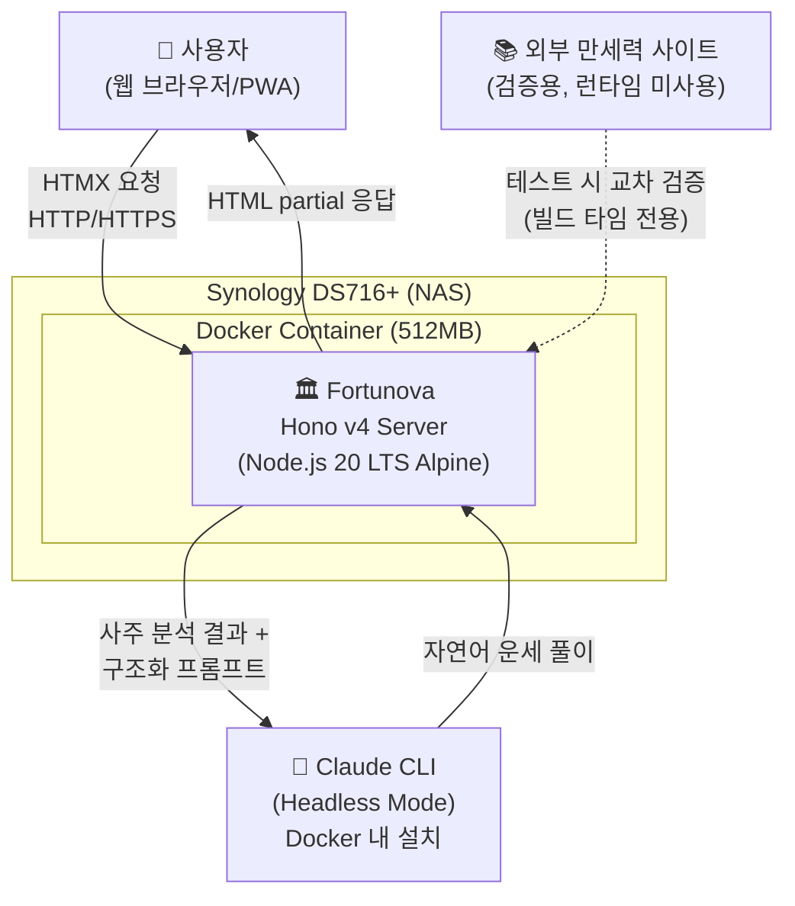
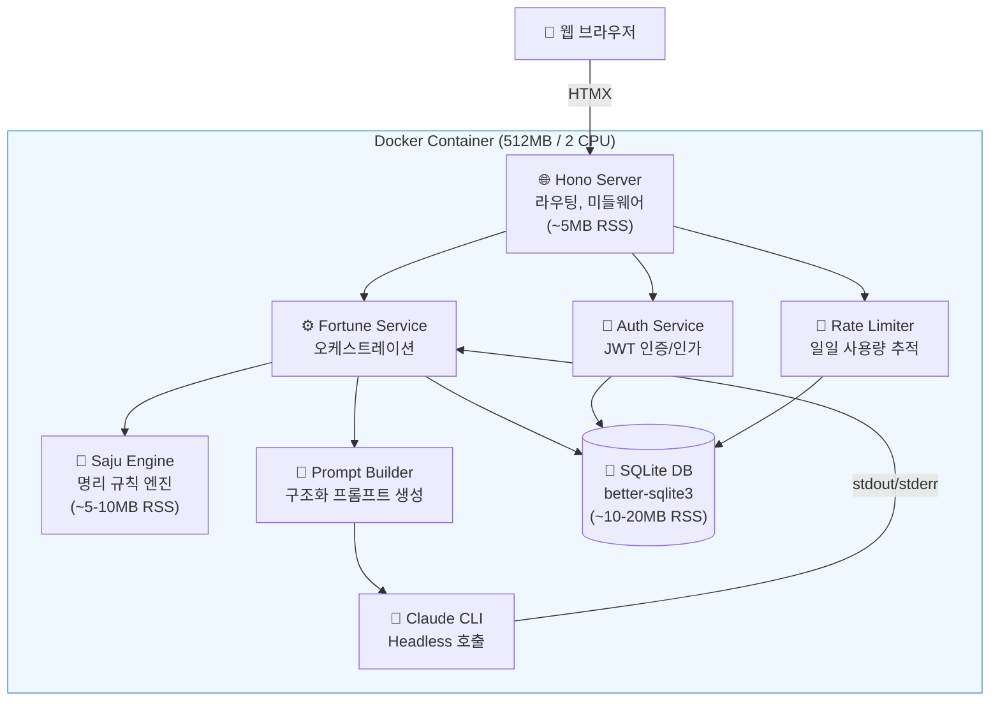
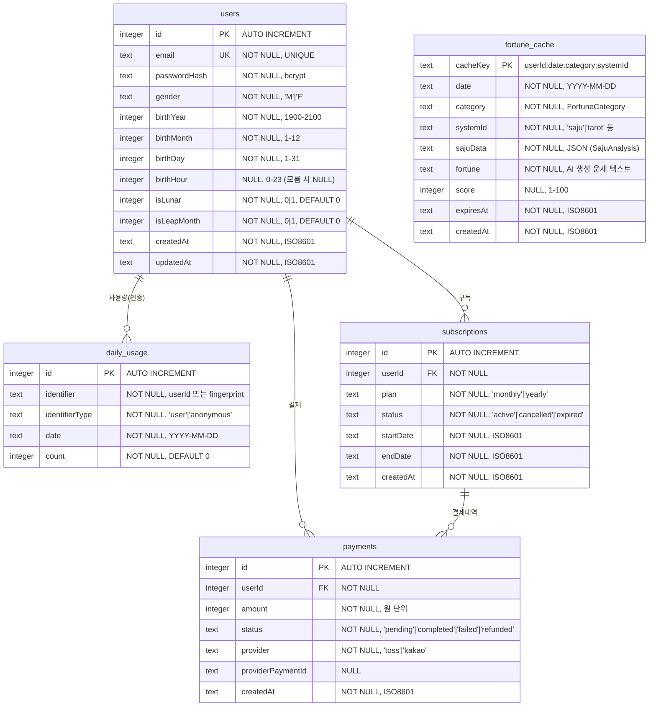
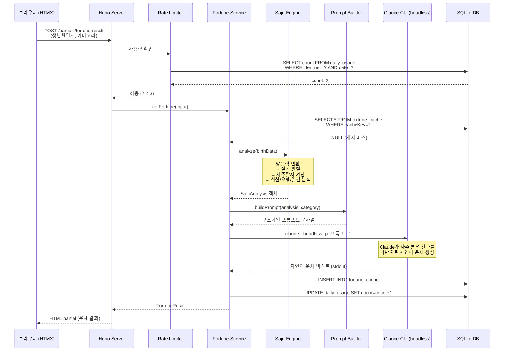
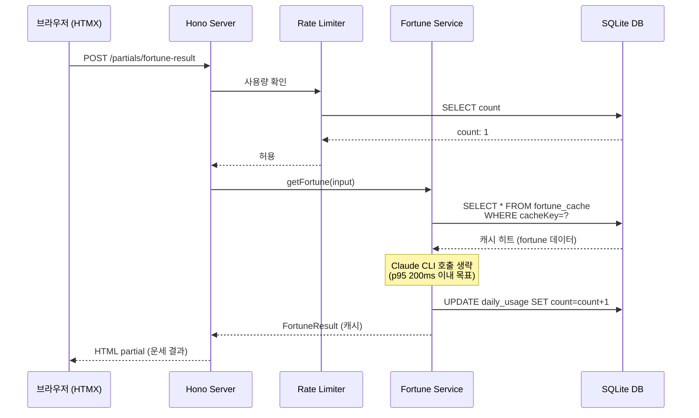
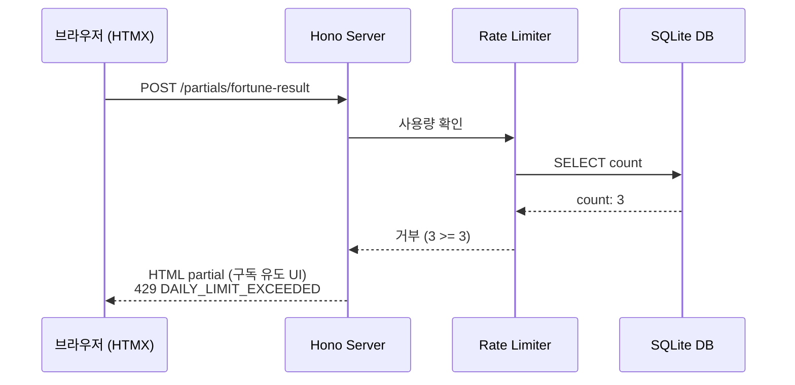

## 1. 개요

### 1.1 배경

국내 운세 서비스 시장에는 5개 유형의 플레이어가 존재한다:

| 서비스 | 유형 | 핵심 특징 | 누적 이용자 |
|--------|------|----------|------------|
| 네이트 운세 | 전통 포털형 | 다양한 콘텐츠 + 전문가 전화상담 | - |
| 포스텔러 | 모바일 앱 | 동서양 운세 통합 + 월 22편 신규 콘텐츠 | 860만+ |
| 신운세 | 전문 웹 | 사주/명리 전문 특화 (만세력, 택일, 작명) | - |
| Co-Star | 모바일 앱 | NASA 데이터 + AI 점성술, 소셜 바이럴 | 3,000만+ |
| 신한생명/농협 | 프로모션 웹 | 기업 브랜딩 목적 무료 시즌 한정 | - |

기존 서비스들은 두 가지 한계를 공통으로 가진다:
1. **전통 명리학 서비스**(네이트, 신운세)는 정형화된 텍스트를 반복 출력하며 개인화 수준이 낮다
2. **AI 기반 서비스**(Co-Star)는 서양 점성술에 특화되어 동양 명리학 영역을 다루지 않는다

### 1.2 동기

사주/명리학은 한국에서 연간 4조원 규모의 시장이나, 기술 기반 혁신이 가장 더딘 분야 중 하나다. 전통 규칙 엔진(천간지지, 오행, 60갑자, 십신 등)의 정확한 계산과 LLM의 자연어 해설 능력을 결합하면, Co-Star가 서양 점성술에서 달성한 AI 초개인화를 동양 명리학에 적용할 수 있다.

NAS(Synology DS716+, 2GB RAM) 환경에서 자체 호스팅하여 인프라 비용을 최소화하면서, 무료 3회/일 + 구독 모델로 수익 구조를 검증한다.

### 1.3 문제 정의

전통 사주 명리 규칙 엔진의 계산 정확성과 LLM의 자연어 해설 능력을 하나의 경량 시스템으로 결합하여, NAS 환경(512MB 메모리)에서 안정적으로 운영 가능한 AI 운세 웹서비스를 구축한다.

---

## 2. Goals & Non-Goals

### 2.1 Goals

1. **사주 계산 정확도 100%**: 전통 사주 명리 규칙 엔진과 Claude를 결합한 하이브리드 운세 시스템을 구축하여, 50+ 검증 케이스(만세력닷컴, 더큼만세력, 척척만세력 교차 검증)에서 사주팔자 계산 정확도 100%를 달성한다
2. **NAS 환경 최적화 운영**: NAS(DS716+, Celeron N3160, 2GB RAM) 환경에서 Docker 컨테이너 512MB 메모리 제한 내 안정 운영하며, 운세 조회 API p95 응답시간 3초 이내(캐시 히트 시 200ms 이내)를 달성한다
3. **플러그인 확장 아키텍처**: `FortuneSystem` 인터페이스 기반 플러그인 아키텍처로 사주 외 타로/별자리 등 운세 체계를 코드 변경 없이 확장 가능하게 설계한다
4. **MVP 출시 및 수익 모델 검증**: MVP(오늘의 운세)를 TDD 기반으로 단계별 구현하여, 무료 3회/일 + 구독 모델의 수익 구조를 갖춘 웹서비스를 출시한다

### 2.2 Non-Goals

1. **1:1 전문가 상담 및 커뮤니티/게시판 기능**은 구현하지 않는다
2. **네이티브 모바일 앱**은 개발하지 않는다 (PWA로 대응)
3. **자체 LLM 모델 학습/파인튜닝**은 하지 않는다
4. **Claude API SDK(@anthropic-ai/sdk)를 직접 사용하지 않는다** — Claude CLI 헤드리스 모드로 LLM 연동한다 (Docker 내 Claude CLI 설치 후 headless 호출)

---

## 3. 상세 설계

### 3.1 아키텍처

#### 3.1.1 시스템 컨텍스트 (C4 Level 1)



#### 3.1.2 컨테이너 다이어그램 (C4 Level 2)



#### 3.1.3 기술 스택

| 영역 | 선택 | 버전 | 사유 |
|------|------|------|------|
| 런타임 | Node.js (Alpine) | 20 LTS | 안정성 검증, Bun 대비 메모리 누수 위험 없음 |
| 서버 프레임워크 | Hono | v4 | 14KB 번들, Web Standards API, 미들웨어 풍부 |
| 프론트엔드 | HTMX + Hono JSX | - | 클라이언트 JS 프레임워크 불필요, SSR + 부분 업데이트 |
| 스타일링 | Tailwind CSS | 빌드타임 | 사용 클래스만 추출, 런타임 오버헤드 0 |
| 데이터베이스 | SQLite | better-sqlite3 | 별도 프로세스 없음, 파일 기반, 동기 API |
| ORM | Drizzle ORM | - | 경량, TypeScript 네이티브, 제로 런타임 |
| LLM 연동 | Claude CLI | headless mode | Docker 내 설치, SDK 의존성 없이 프로세스 호출 |
| 인증 | 자체 JWT | jose 라이브러리 | 외부 인증 서비스 의존성 제거 |
| 테스트 | Vitest | - | 빠른 실행, TypeScript 네이티브, HMR 지원 |
| 배포 | Docker | node:20-alpine | 이미지 ~80MB, RSS ~80-125MB |

#### 3.1.4 사주 엔진 모듈 구조

```
src/engine/
  core/                    # 천간(10), 지지(12), 오행(5), 60갑자, 음양
  calendar/                # 양음력 변환(KASI 기반), 24절기, 진태양시 보정
  saju/                    # 사주팔자 계산, 십신, 12운성, 신살, 대운/세운
  analysis/                # 오행균형 분석, 일간강약 판별, 용신 결정
  types/                   # TypeScript 타입 정의
  data/                    # 음력/절기 데이터 (1900-2100, ~5-10MB)
```

#### 3.1.5 디렉토리 구조

```
fortunova/
  src/
    index.ts                  # 진입점
    app.ts                    # Hono 앱 설정
    config.ts                 # 환경 설정 (DATABASE_PATH, JWT_SECRET 등)
    engine/                   # 사주 엔진 (3.1.4 참조)
    fortune/                  # 운세 시스템 (플러그인)
      types.ts                # FortuneSystem 인터페이스
      registry.ts             # 시스템 레지스트리
      systems/saju-system.ts  # MVP: 사주 시스템 구현체
    services/
      llm.ts                  # Claude CLI headless 호출 래퍼
      prompt-builder.ts       # 사주 분석 결과 → 구조화 프롬프트
      fortune.ts              # 운세 오케스트레이션 (엔진+LLM+캐시)
      auth.ts                 # 회원가입/로그인/JWT 발급
      subscription.ts         # 구독 관리
    routes/
      pages.tsx               # SSR 페이지 (HTMX 전체 문서)
      api/                    # REST API 엔드포인트
      partials/               # HTMX partial 응답
    middleware/
      rate-limit.ts           # 무료 횟수 제한 (3회/일)
      auth.ts                 # JWT 검증 미들웨어
    db/
      schema.ts               # Drizzle ORM 스키마
      migrate.ts              # 마이그레이션
    views/                    # JSX 템플릿 (레이아웃, 컴포넌트)
  tests/
    engine/                   # 사주 엔진 단위 테스트 (50+ 케이스)
    services/                 # 서비스 통합 테스트
    fixtures/
      known-saju-cases.ts     # 교차 검증된 사주 정답 데이터
  docker/
    Dockerfile                # node:20-alpine 기반
    docker-compose.yml        # 512MB 메모리, 2 CPU 제한
```

#### 3.1.6 핵심 타입 정의

```typescript
// 천간 (10개)
type HeavenlyStem = '갑'|'을'|'병'|'정'|'무'|'기'|'경'|'신'|'임'|'계';

// 지지 (12개)
type EarthlyBranch = '자'|'축'|'인'|'묘'|'진'|'사'|'오'|'미'|'신'|'유'|'술'|'해';

// 오행
type FiveElement = '목'|'화'|'토'|'금'|'수';

// 간지 (천간+지지 조합)
interface GanJi {
  stem: HeavenlyStem;
  branch: EarthlyBranch;
}

// 사주팔자 (네 기둥)
interface FourPillars {
  year: GanJi;   // 년주 (입춘 기준 전환)
  month: GanJi;  // 월주 (절기 기준 전환)
  day: GanJi;    // 일주 (만세력 기반)
  hour: GanJi;   // 시주 (야자시/조자시 구분)
}

// 사주 분석 결과
interface SajuAnalysis {
  fourPillars: FourPillars;
  tenGods: Record<string, TenGod>;       // 십신
  elementBalance: Record<FiveElement, number>; // 오행 비율
  dayMasterStrength: 'strong' | 'weak' | 'neutral'; // 일간 강약
  usefulGod: FiveElement;                 // 용신
  majorFate: MajorFatePeriod[];           // 대운
}
```

#### 3.1.7 FortuneSystem 플러그인 인터페이스

```typescript
interface FortuneSystem {
  id: string;                    // 'saju', 'tarot', 'zodiac'
  name: string;                  // '사주/명리', '타로', '별자리'
  requiredInput: InputField[];   // 필요한 입력 필드 정의
  analyze(input: Record<string, unknown>): Promise<SystemAnalysis>;
  buildPrompt(analysis: SystemAnalysis, category: FortuneCategory): string;
  parseResult(llmResponse: string): FortuneResult;
}

// 운세 카테고리
type FortuneCategory = 'daily' | 'love' | 'career' | 'health' | 'wealth';

// 입력 필드 정의
interface InputField {
  name: string;
  type: 'date' | 'time' | 'select' | 'boolean';
  required: boolean;
  label: string;
}
```

### 3.2 데이터 모델

#### 3.2.1 ERD



#### 3.2.2 인덱스 전략

| 테이블 | 인덱스 | 컬럼 | 용도 |
|--------|--------|------|------|
| `fortune_cache` | PK | `cacheKey` | 캐시 조회 (userId:date:category:systemId) |
| `fortune_cache` | IDX | `expiresAt` | 만료 캐시 정리 배치 |
| `daily_usage` | UNIQUE | `identifier, date` | 일일 사용량 중복 방지 |
| `subscriptions` | IDX | `userId, status` | 활성 구독 조회 |
| `users` | UNIQUE | `email` | 로그인 조회 |

### 3.3 API 설계

#### 3.3.1 운세 조회

##### `POST /api/v1/fortune`

오늘의 운세를 조회한다. 캐시가 존재하면 캐시에서 반환하고, 없으면 사주 엔진 + Claude CLI로 생성한다.

**요청**:
```json
{
  "birthYear": 1990,
  "birthMonth": 5,
  "birthDay": 15,
  "birthHour": 14,
  "isLunar": false,
  "isLeapMonth": false,
  "gender": "M",
  "category": "daily",
  "systemId": "saju"
}
```

**응답** (200 OK):
```json
{
  "fortune": {
    "summary": "오늘은 목(木) 기운이 강해지는 날입니다...",
    "detail": "갑오일주인 당신은 오늘...",
    "score": 78,
    "advice": "오전에 중요한 결정을 내리세요...",
    "luckyColor": "녹색",
    "luckyNumber": 3
  },
  "sajuSummary": {
    "fourPillars": "갑오 기사 병인 경신",
    "dayMasterStrength": "strong",
    "todayElement": "목"
  },
  "cached": false,
  "remainingFreeCount": 2
}
```

**에러 코드**:

| HTTP 코드 | 에러 코드 | 설명 |
|----------|----------|------|
| 400 | `INVALID_BIRTH_DATA` | 생년월일시 유효성 검증 실패 |
| 400 | `UNSUPPORTED_SYSTEM` | 지원하지 않는 운세 시스템 ID |
| 429 | `DAILY_LIMIT_EXCEEDED` | 일일 무료 3회 초과 (구독 필요) |
| 503 | `LLM_UNAVAILABLE` | Claude CLI 호출 실패 |

#### 3.3.2 인증

##### `POST /api/v1/auth/register`

**요청**:
```json
{
  "email": "user@example.com",
  "password": "securePassword123!",
  "gender": "M",
  "birthYear": 1990,
  "birthMonth": 5,
  "birthDay": 15,
  "birthHour": 14,
  "isLunar": false
}
```

**응답** (201 Created):
```json
{
  "token": "eyJhbG...",
  "user": {
    "id": 1,
    "email": "user@example.com"
  }
}
```

##### `POST /api/v1/auth/login`

**요청**:
```json
{
  "email": "user@example.com",
  "password": "securePassword123!"
}
```

**응답** (200 OK):
```json
{
  "token": "eyJhbG...",
  "user": {
    "id": 1,
    "email": "user@example.com"
  }
}
```

#### 3.3.3 구독

##### `GET /api/v1/subscription/plans`

**응답** (200 OK):
```json
{
  "plans": [
    {
      "id": "monthly",
      "name": "월간 구독",
      "price": 9900,
      "currency": "KRW",
      "features": ["무제한 운세 조회", "상세 사주 분석"]
    },
    {
      "id": "yearly",
      "name": "연간 구독",
      "price": 99000,
      "currency": "KRW",
      "features": ["무제한 운세 조회", "상세 사주 분석", "2개월 무료"]
    }
  ]
}
```

##### `POST /api/v1/subscription/subscribe`

**요청** (인증 필수):
```json
{
  "planId": "monthly",
  "paymentProvider": "toss"
}
```

#### 3.3.4 HTMX 페이지 라우트

| 메서드 | 경로 | 설명 |
|--------|------|------|
| GET | `/` | 메인 페이지 (생년월일 입력 폼) |
| GET | `/fortune` | 운세 결과 페이지 |
| GET | `/login` | 로그인 페이지 |
| GET | `/register` | 회원가입 페이지 |
| GET | `/mypage` | 마이페이지 (인증 필수) |
| GET | `/subscribe` | 구독 안내 페이지 |
| POST | `/partials/fortune-result` | HTMX partial: 운세 결과 HTML 조각 |
| POST | `/partials/login-form` | HTMX partial: 로그인 처리 후 결과 |

### 3.4 시퀀스 다이어그램

#### 3.4.1 운세 조회 흐름 (캐시 미스)



#### 3.4.2 운세 조회 흐름 (캐시 히트)



#### 3.4.3 일일 무료 초과 흐름



---
